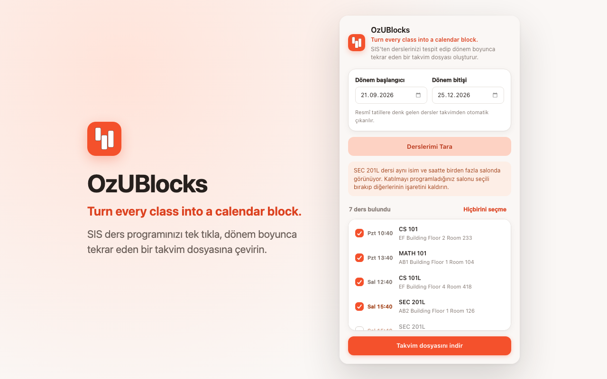

<p align="center">
  
</p>

<h1 align="center">OzUBlocks</h1>

<p align="center"><strong>Turn every class into a calendar block.</strong></p>

<p align="center">
  A browser extension that turns your Özyeğin University SIS course schedule into a calendar file that repeats every week of the semester.
</p>



## Features

- **One click.** The extension opens the *Ders Programım* screen in SIS by itself and reads your courses.
- **Whole semester.** Each course becomes one weekly event from the term start date to the term end date.
- **Public holidays.** Lessons that fall on an official holiday are left out of the calendar.
- **Room conflicts.** If one course shows in more than one room at the same time, the popup names the course so you can keep only your room.
- **Any calendar app.** The `.ics` file imports into Google Calendar, Apple Calendar, and Outlook.
- **Private.** All work happens in your browser. The extension sends no data to any server.

## Install

To install from source in Chrome or Brave:

1. Download or clone this repository.
2. Open `chrome://extensions` (or `brave://extensions`) and turn on **Developer mode**.
3. Click **Load unpacked** and select the repository folder.

## Use

1. Log in to [SIS](https://sis.ozyegin.edu.tr/).
2. Click the OzUBlocks icon in the toolbar.
3. Check the term dates. They default to Fall 2026 (21 September – 25 December).
4. Click **Derslerimi Tara**. The extension opens *Ders Programım* and lists your courses.
5. Clear the check box for each course or room that you do not attend.
6. Click **Takvim dosyasını indir**, then import the file into your calendar app.

If you click the icon on a different website, the extension opens SIS for you.

The week that SIS shows does not matter. The term start date decides where the calendar begins.

`sample.ics` shows the output format. It contains made-up courses, rooms, and names.

## Privacy

The extension reads course names, times, and rooms from `sis.ozyegin.edu.tr` only. It stores only the term dates, in the local storage of the browser. See [store/PRIVACY.md](store/PRIVACY.md).

OzUBlocks is an independent student project. It has no official connection to Özyeğin University.

## How it finds the data

SIS is a SmartClient app. The calendar widget keeps its records at:

```js
window.isc_CNCalenderImpl_1_0.data.localData
```

Each record has `startDate` and `endDate` as real Date objects, plus `name`, `description`, `eventId` and `eventLength`. No scraping, no pixel math.

Two things make this awkward in an extension:

- The calendar lives in an iframe, so the script needs `allFrames: true`.
- Content scripts run in an isolated JS world and cannot see page globals. The script must run with `world: "MAIN"`. This is the part that silently returns nothing if you get it wrong.

Both are handled through `chrome.scripting.executeScript` from the popup, which is why there's no content script in the manifest.

## Things that will need attention

**The widget only holds the visible week.** Records are refetched when you change weeks. That's why recurrence is built with `RRULE` from one week rather than reading the whole term.

**`eventId` is stable across weeks**, so it's used for UIDs. Calendar apps that match on UID update existing events on re-import instead of duplicating them. Bump `SEQUENCE` if you regenerate after a schedule change.

**Same course, same time, different rooms.** SIS can list one course several times in the same time slot, once for each room. This is usually one session split across rooms, not separate classes. Uncheck the rooms you do not attend, or the calendar gets overlapping events every week.

**The first week is the least reliable.** Semesters often start mid-week and early sessions get cancelled. Check week one after importing.

**Holidays** are in the `HOLIDAYS` list at the top of `popup.js`. Fall 2026 has one: `2026-10-29`. For a new term, edit this list and the default dates in `popup.html`. Scraping the university's academic calendar page would remove this step.

## If SIS changes

The global name is matched by pattern (`isc_CNCalenderImpl_*`), not hardcoded, so a renumbered widget still works. If the extension stops finding courses, open the console on the SIS iframe and run:

```js
Object.keys(window).filter(k => /CNCalender/i.test(k))
```

## License

[MIT](LICENSE)
